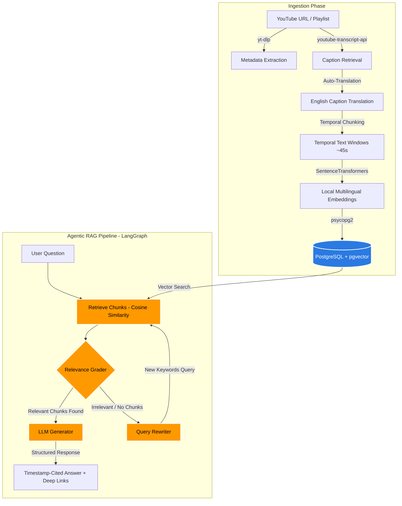

# YouTube RAG: Multi-Video & Playlist QA Agent

A production-ready Retrieval-Augmented Generation (RAG) system that allows users to ask questions across multiple YouTube videos or entire playlists and receive answers cited with precise timestamps and deep links. 

The system leverages **local multilingual embeddings ($0 API cost)**, a **PostgreSQL vector database (`pgvector`)**, and a **self-correcting LangGraph agentic pipeline** powered by Groq's free-tier LLM API.

---

## 🏗️ Architecture Design

The application is structured as a modular, containerized three-tier architecture:
1. **Frontend**: React-based interactive UI.
2. **Backend (FastAPI)**: Ingestion & querying pipelines.
3. **Database (PostgreSQL + pgvector)**: Vector database storing chunks, metadata, and high-dimensional embeddings.



---

## 🚀 How the RAG Pipeline Works (Easy Steps)

This system uses an **Agentic (self-correcting) RAG pattern** rather than a simple top-k lookup. Here is what happens when you ask a question:

### Step 1: Vector-Based Retrieval
The system takes your question and converts it into a high-dimensional vector. It runs a **cosine similarity search** against the PostgreSQL `pgvector` database to find the top $k$ transcript chunks matching the context of your query.

### Step 2: Relevance Grading (LangGraph Decision Loop)
Before sending the snippets to the main LLM to generate an answer, a fast relevance grader evaluates the retrieved chunks. 
* **If the chunks are relevant**: The pipeline routes directly to the **Generation** step.
* **If the chunks are irrelevant or empty**: The pipeline routes to the **Query Refinement** step.

### Step 3: Self-Correction (Query Refinement)
If the initial retrieval matched poorly, the agent doesn't hallucinate an answer. Instead, it prompts the LLM to rewrite your question into a keyword-dense search query, queries the database again with this new query, and proceeds to Generation. This loop runs once to guarantee optimal context selection.

### Step 4: Citations & Deep-Link Generation
The final LLM takes the context snippets, translates any remaining foreign text to your requested language, and constructs a detailed response. Crucially, the LLM maps each fact back to the exact second in the video, rendering markdown citations with deep links: `[Video Title @ 12:34](https://youtu.be/VIDEOID?t=754)`.

---

## ⚡ Key Features

* **$0 API Costs for Embeddings**: Generates embeddings locally using HuggingFace's `sentence-transformers` (`paraphrase-multilingual-MiniLM-L12-v2`, 384-dimensions) running on your local CPU/GPU.
* **Smart Captions & Translation**: Prioritizes native English captions. If a video is in another language (e.g. Hindi/Hinglish), it retrieves the transcript and automatically translates it to English during ingestion to ensure high-accuracy search matching.
* **Dynamic Citations**: Automatically maps response assertions back to the video source and precise timestamp seconds.
* **Graph-Driven Logic**: Utilizes **LangGraph** to construct the retrieval-grade-refine state-machine loop.

---

## 🛠️ Setup & Installation

### Prerequisites
* Docker & Docker Compose (or Python 3.11+ and PostgreSQL with `pgvector` installed locally).
* A free Groq API key from [console.groq.com/keys](https://console.groq.com/keys).

### Local Run via Docker (Recommended)
1. Clone the repository and navigate to the directory:
   ```bash
   git clone <your-repo-link>
   cd youtube-rag
   ```
2. Create your `.env` file from the template:
   ```bash
   cp .env.example .env
   ```
3. Open `.env` and add your **`GROQ_API_KEY`**.
4. Launch the services:
   ```bash
   docker compose up --build
   ```
   * Fast API backend runs at: `http://localhost:8000`
   * API Documentation (Swagger): `http://localhost:8000/docs`

---

## 💼 Add to Your Resume

Here are resume-ready bullet points to highlight this project on your CV:

* **Architected and deployed a Retrieval-Augmented Generation (RAG) agent** that ingests YouTube videos/playlists and provides timestamp-cited answers, using **FastAPI**, **LangGraph**, and **PostgreSQL (`pgvector`)**.
* **Designed a self-correcting retrieval pipeline** using **LangGraph** to construct a feedback loop that evaluates snippet relevance and dynamically rewrites query inputs, reducing hallucinations.
* **Optimized API operating costs to $0** by implementing local multilingual embedding generation (`sentence-transformers`) and leveraging Groq's high-throughput free-tier LLM API.
* **Engineered custom multilingual preprocessing** that translates and standardizes foreign-language caption tracks (e.g., Hindi/Hinglish) into English at ingestion, resulting in high-performance semantic retrieval matching.
